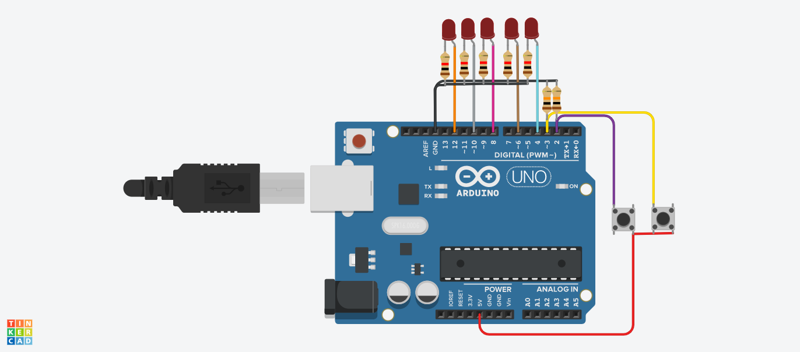

# September14
## Concept description:
For this production assignment, I wanted to generate two different patterns for the two switches, in which both of the switches will be controlling all the 5 LEDs connected to the Arduino.   

  
  **For switch 1 (Purple wire):**   
  I wanted to reflect a light pattern which will keep iterating until termination which will have a different pattern. The pattern produced by this switch was a simplified, restricted version of a (potentially) functional system which will always have a certain LED pattern going but depending on some external factor, will change the pattern.  
  

 

  
  **For switch 2 (Yellow wire):**   
I wanted to recreate the first tune in the song Jingle Bells as played on the piano. This concept came from the idea of creating the illusion of listening to this song through the light pattern. I chose Jingle Bells because it was a common song and therefore, easier for the viewer to correlate the tune to the LED pattern and also because I was using 5 LEDs and the tune shown also uses 5 keynotes on the piano. Therefore, each LED corresponds to one keynote on the piano.

## Circuit: 

## Schematic: 
[Hand drawn figure of my circuit.](schematic.png)

## Problems and Solutions:
***Problem 1:*** My initial idea was to have both switches connected in terms of their functionality and pattern. Therefore, I thought of having the first switch run indefinitely and pressing the second switch would produce a different pattern which would terminate the loop. This did not work since I ran into the problem that the program would wait till the first switch finishes executing to allow us to press (and see the pattern) on the second switch which in my case was not possible since the loop in my first switch runs indefinitely.  
***Solution 1:*** I decided to adapt the same concept but restricting it to using one switch to perform both patterns and allowing the loop (that was suppose to run indefinitely) to iterate 3 times. I then proceeded to explain the purpose of this concept in the documentation. 
***Problem 2:*** This was a technical problem in which my code (which contains multiple functions) would produce an error message stating that using the functions I defined in void loop() are not declared in the scope.   
***Solution 2:*** After googling and researching the error message, it turns out that the c++ compiler needed these functions to be declared before the void loop() function where they are used. Therefore, I added the function declaration before void loop() keeping the function definitions where they were. 
## Further notes: 
While my concepts at this stage are mainly purposeless as a pose to functional, they can both be adapted and potentially incorporated in larger systems for functional use. 
For example, the first switch idea could be used with different sensors that could trigger the second pattern of the switch. This could be used to detect high pressure, high temperature and other attributes that can have a threshold value. The second switch idea could be adapted into pianos in which the lights are used to guide beginner piano players to a certain tune ( I am sure this already exists somewhere). 

## References: 
https://www.youtube.com/watch?v=SEpOmHH_RzU  
https://community.platformio.org/t/ledblink-was-not-declared-in-this-scope/14768
