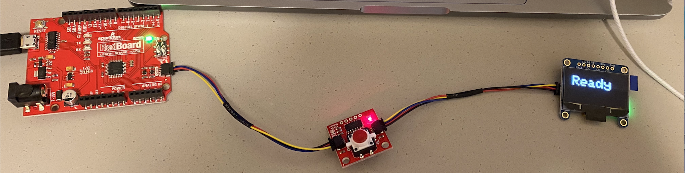

# Assignment 3

  This was my first time setting up two different components that are connected to an arduino. I had to make sure my setup is correct before I started altering the code. To do that, I connected the button and OLED and ran a basic program that prints into the serial monitor if the button and OLED ware acknowledged, if they both are, then I assumed my setup is correct and proceeded with the code. 
  

  
## Setup: 

## Demo: 

## Notes about the code: 

  Even though some functions are extremely simple and could easily be included in the code, having them in the form of functions made it significantly easier for me to read, understand, debug and work with my code. Additionally, using the serial monitor was really helpful to make sure that my components are connected correctly and helped me debug. Also, most of the libraries and setup parts were taken from the examples that are already given and just modified them to do what is required in this assignment. 

 

